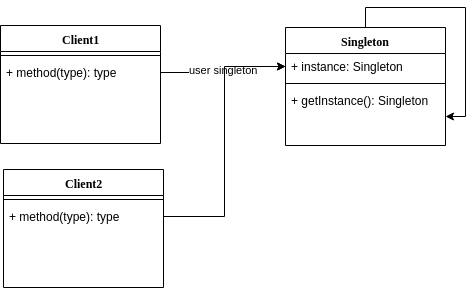

# Singleton (creational pattern)

Singleton is a creational design pattern that allows us to ensure that a class has a single instance, while providing a global access point to that instance. It is useful when an object is very heavy to create or requires a lot of computational resources to create.

More info: [Singleton pattern - Wikipedia](https://en.wikipedia.org/wiki/Singleton_pattern)

# Strategy (behavioral pattern)

The strategy pattern allows you to maintain a set of algorithms from which the client object can choose the one that suits it best and dynamically swap it according to its needs.

It helps to extend behaviors without modifying other existing behaviors. It is useful for new changes in requirements or functionalities in systems.

More info: [Strategy (patrón de diseño) - Wikipedia, la enciclopedia libre](https://es.wikipedia.org/wiki/Strategy_(patr%C3%B3n_de_dise%C3%B1o))

# Decorator (structural pattern)

In object-oriented programming, the decorator pattern is a design pattern that allows behavior to be added to an individual object, dynamically, without affecting the behavior of other instances of the same class. The decorator pattern is often useful for adhering to the Single Responsibility Principle, as it allows functionality to be divided between classes with unique areas of concern as well as to the Open-Closed Principle, by allowing the functionality of a class to be extended without being modified. Decorator use can be more efficient than subclassing, because an object's behavior can be augmented without defining an entirely new object.

More info: [Decorator pattern - Wikipedia](https://en.wikipedia.org/wiki/Decorator_pattern)

# Observer (behavioral pattern)

Observer Design Pattern is a behavioral pattern that establishes a one-to-many dependency between objects. When the subject changes its state, all its observers are automatically notified and updated. It focuses on enabling efficient communication and synchronization between objects in response to state changes.

More info: [Observer Design Pattern - GeeksforGeeks](https://www.geeksforgeeks.org/system-design/observer-pattern-set-1-introduction/)

# Dependency injection (Software design pattern)

Dependency injection is a programming technique that makes a class independent of its dependencies. It achieves that by decoupling the usage of an object from its creation. This helps you to follow SOLID’s dependency inversion and single responsibility principles.

More info: [Design Patterns Explained – Dependency Injection- Stackify](https://stackify.com/dependency-injection/)

# Factory Method (creational pattern)

This pattern allows you to create objects without specifying the object type.

More info: [Factory method pattern - Wikipedia](https://en.wikipedia.org/wiki/Factory_method_pattern)

# State (behavioral pattern)

An object has a state. Depending on its state, it will have different behaviors. This behavior can change at runtime. Protects from unexpected behavior.

More info: [State Design Pattern - GeeksforGeeks](https://www.geeksforgeeks.org/system-design/state-design-pattern/) and [State](https://refactoring.guru/design-patterns/state)

# Builder (creational pattern)

It's useful when dealing with objects that have very large constructors—objects that require a great deal of complexity to create. It allows you to create a complex object step by step.

More info: [Builder](https://refactoring.guru/design-patterns/builder) or [Builder Design Pattern - GeeksforGeeks](https://www.geeksforgeeks.org/system-design/builder-design-pattern/) or [Builder Design Pattern - DEV Community](https://dev.to/srishtikprasad/builder-design-pattern-3a7j)

# Bridge (structural pattern)

It serves to separate the actions of "what do you do?" from "how do you do it?". In other words, "lets you split a large class or a set of closely related classes into two separate hierarchies—abstraction and implementation—which can be developed independently of each other." It defines a bridge between an abstraction that you will actually use in your system and a smaller implementation that you can scale, being able to change its behavior without needing to modify the abstraction that you will actually use in your system. That is the goal of Bridge: to separate the "what" from the "how".

More info: [Bridge](https://refactoring.guru/design-patterns/bridge)

# Iterator (behavioral pattern)

A design pattern that manages collections to allow for iterations without exposing the logic. We can define who comes next.

More info: [Iterator](https://refactoring.guru/es/design-patterns/iterator)

# Abstract Factory (creational pattern)

This pattern seeks to group a set of classes that have a common function called families, which are created through a Factory. This pattern is especially useful when we need to have certain families of classes to solve a problem. However, it may be necessary to create parallel implementations of these classes to solve the same problem but with a different implementation.

More info:

+ [Abstract Factory](https://reactiveprogramming.io/blog/es/patrones-de-diseno/abstract-factory)

+ [Abstract Factory](https://refactoring.guru/es/design-patterns/abstract-factory)

# Prototype (creational pattern)

This pattern clones objects. It arises from the need to clone an object which requires a lot of computational resources to create. Its construction required a lot of time since it was possible to consult APIs or Databases. It allows us to copy existing objects without the code depending on their classes. Its functionality in cloning objects, these new objects are created through a pool of prototypes previously prepared and stored.

More info:

+ [Prototype](https://refactoring.guru/es/design-patterns/prototype)

+ [Prototype](https://reactiveprogramming.io/blog/es/patrones-de-diseno/prototype)

To be continued...
